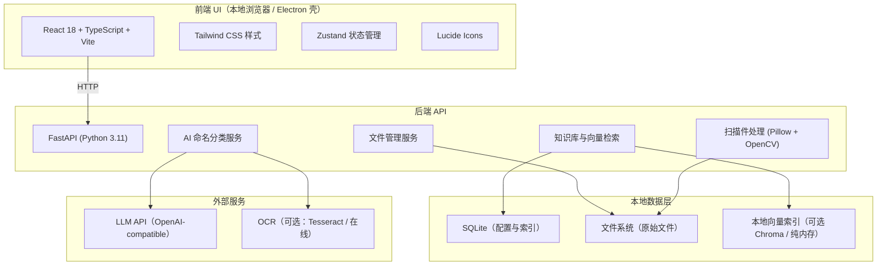
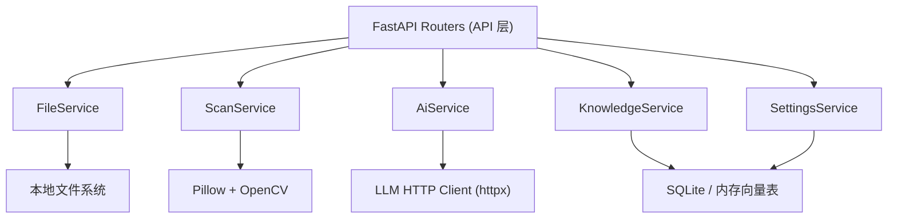
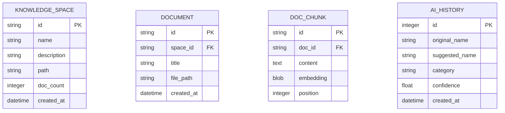

# AI办公助手 · 技术架构文档

> 版本：v0.1.0 ｜ 更新日期：2026-06-18

---

## 1. 架构设计



**架构原则**：
- 轻量优先：单机本地部署，无需云端依赖即可完成核心功能
- 分层清晰：UI / API / 服务 / 数据 严格分层
- AI 可切换：LLM 层抽象，通过统一接口适配多家兼容 OpenAI 的模型

---

## 2. 技术描述

### 2.1 前端

| 技术 | 版本 | 用途 |
| --- | --- | --- |
| React | 18 | UI 框架 |
| TypeScript | 5.x | 类型安全 |
| Vite | 5.x | 构建工具与开发服务器 |
| Tailwind CSS | 3.4 | 原子化样式 |
| zustand | 4.x | 状态管理 |
| lucide-react | 0.460 | 图标 |
| react-router-dom | 6.x | 路由 |

### 2.2 后端

| 技术 | 版本 | 用途 |
| --- | --- | --- |
| FastAPI | 0.115 | Web 框架（带自动生成 OpenAPI） |
| Python | 3.11 | 运行时 |
| Uvicorn | 0.32 | ASGI 服务器 |
| Pillow | 10.x | 图像处理 |
| opencv-python | 4.10 | 纠偏、边缘检测 |
| pydantic | 2.x | 数据校验 |
| aiofiles | 24.x | 异步文件 IO |
| httpx | 0.27 | LLM HTTP 客户端 |
| chromadb | 0.5 | 本地向量库（可选） |
| SQLite | 内置 | 轻量关系数据 |

### 2.3 初始化工具

- 项目使用 `vite-init` 创建前端项目骨架（`react-ts` 模板
- 后端独立目录 `api/` 使用 `python -m uvicorn` 启动

---

## 3. 路由定义

### 3.1 前端路由

| 路由 | 页面 | 说明 |
| --- | --- | --- |
| `/` | 首页仪表盘 | 概览与快捷入口 |
| `/files` | 文件工作台 | 目录浏览与文件操作 |
| `/scan` | 扫描件处理 | 图片纠偏与批量增强 |
| `/ai` | AI 智能命名分类 | 调用 LLM 建议命名与分类 |
| `/knowledge` | 知识库 | 知识空间管理 + 问答 |
| `/settings` | 系统设置 | 配置工作目录、LLM、主题 |

### 3.2 后端 API 路由

| 方法 | 路径 | 说明 |
| --- | --- | --- |
| GET | `/api/health` | 健康检查 |
| GET | `/api/files/tree` | 目录树 |
| GET | `/api/files/list` | 文件列表 |
| POST | `/api/files/rename` | 重命名文件 |
| POST | `/api/files/move` | 移动文件 |
| POST | `/api/scan/enhance` | 扫描件纠偏增强 |
| POST | `/api/ai/analyze` | AI 批量分析（命名+分类） |
| GET | `/api/knowledge/spaces` | 知识空间列表 |
| POST | `/api/knowledge/chat` | 知识库问答 |
| GET | `/api/settings` | 获取配置 |
| PUT | `/api/settings` | 更新配置 |

---

## 4. API 定义（核心 TypeScript 类型）

```typescript
// 文件相关
interface FileItem {
  path: string;
  name: string;
  isDir: boolean;
  size: number; // bytes
  mtime: string; // ISO 日期
  ext?: string;
}

interface RenameRequest {
  oldPath: string;
  newName: string;
}

interface MoveRequest {
  source: string;
  targetDir: string;
}

// 扫描件处理
interface EnhanceRequest {
  filePath: string;
  deskew?: boolean;   // 自动纠偏
  rotate?: number;    // 手动旋转角度
  contrast?: number; // 对比度 0-100
  brightness?: number; // 亮度 0-100
}

interface EnhanceResponse {
  outputPath: string;
  applied: string[]; // 实际执行的操作名称
}

// AI 分析
interface AiAnalyzeRequest {
  files: string[];      // 文件路径数组
  mode?: "name" | "category" | "both";
  categories?: string[]; // 用户自定义分类目录（可选）
}

interface AiSuggestion {
  file: string;
  suggestedName: string;
  suggestedCategory: string;
  confidence: number; // 0-1
  reason: string;     // AI 给出的简短说明（中文）
}

interface AiAnalyzeResponse {
  suggestions: AiSuggestion[];
}

// 知识库
interface KnowledgeSpace {
  id: string;
  name: string;
  description?: string;
  docCount: number;
  createdAt: string;
}

interface KnowledgeChatRequest {
  spaceId: string;
  question: string;
}

interface KnowledgeChatResponse {
  answer: string;
  sources: { path: string; snippet: string }[];
}

// 配置
interface Settings {
  workDir: string;
  llmProvider: "openai" | "mock";
  llmModel: string;
  llmApiKey?: string;
  llmBaseUrl?: string;
  namingTemplate?: string;
  theme: "light" | "dark";
}
```

---

## 5. 服务端分层



**分层说明**：
- **Routers**：只负责 HTTP 路由、参数校验、响应组装
- **Service**：实现业务逻辑，不直接依赖 FastAPI（可独立测试）
- **Data**：SQLite 表（本地配置与索引）、本地文件系统、向量索引

---

## 6. 数据模型

### 6.1 数据模型定义



### 6.2 DDL（SQLite）

```sql
CREATE TABLE IF NOT EXISTS knowledge_space (
    id TEXT PRIMARY KEY,
    name TEXT NOT NULL,
    description TEXT,
    path TEXT NOT NULL,
    doc_count INTEGER DEFAULT 0,
    created_at TEXT DEFAULT CURRENT_TIMESTAMP
);

CREATE TABLE IF NOT EXISTS document (
    id TEXT PRIMARY KEY,
    space_id TEXT NOT NULL,
    title TEXT NOT NULL,
    file_path TEXT NOT NULL,
    created_at TEXT DEFAULT CURRENT_TIMESTAMP
);

CREATE INDEX IF NOT EXISTS idx_document_space ON document(space_id);

CREATE TABLE IF NOT EXISTS doc_chunk (
    id TEXT PRIMARY KEY,
    doc_id TEXT NOT NULL,
    content TEXT NOT NULL,
    embedding BLOB,
    position INTEGER DEFAULT 0
);

CREATE INDEX IF NOT EXISTS idx_doc_chunk_doc ON doc_chunk(doc_id);

CREATE TABLE IF NOT EXISTS ai_history (
    id INTEGER PRIMARY KEY AUTOINCREMENT,
    original_name TEXT,
    suggested_name TEXT,
    category TEXT,
    confidence REAL,
    created_at TEXT DEFAULT CURRENT_TIMESTAMP
);

CREATE TABLE IF NOT EXISTS settings (
    key TEXT PRIMARY KEY,
    value TEXT
);
```

---

## 7. 关键技术决策

| # | 决策 | 理由 |
| --- | --- | --- |
| 1 | 使用 **FastAPI + Python** | 开发高效，自动生成 OpenAPI 文档，AI/ML 生态成熟 |
| 2 | 使用 **React + Vite** | HMR 快速开发、轻量，UI 组件化便于维护 |
| 3 | **SQLite 作为唯一数据库** | 单机应用零运维，无需外部服务；后续可平滑迁移到 PostgreSQL |
| 4 | **本地文件系统存储** | 用户文档保持在用户自己控制下，隐私与合规友好 |
| 5 | **向量索引**：默认使用纯内存 + BM25 关键词混合检索；可选集成 Chroma | 在 MVP 阶段降低复杂度、保证离线可用性 |
| 6 | **LLM 抽象层** | 统一 OpenAI-compatible 接口，可兼容通义千问、智谱、DeepSeek 等 |
| 7 | **Mock 模式** | 无 API Key 情况下仍能演示流程，便于早期测试与离线使用 |
| 8 | **桌面壳**：后续可选 Electron 或直接用浏览器作为默认 | 第一版以浏览器访问 localhost 为最小交付 |
